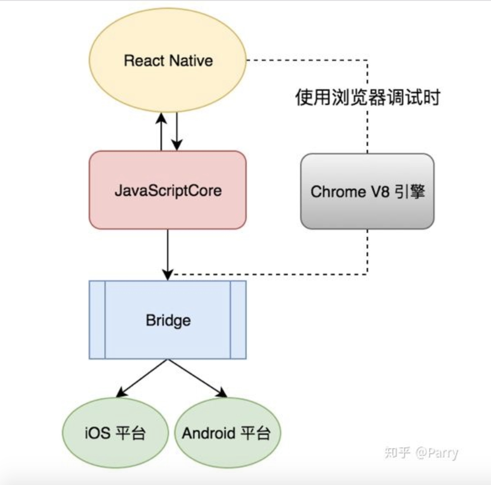
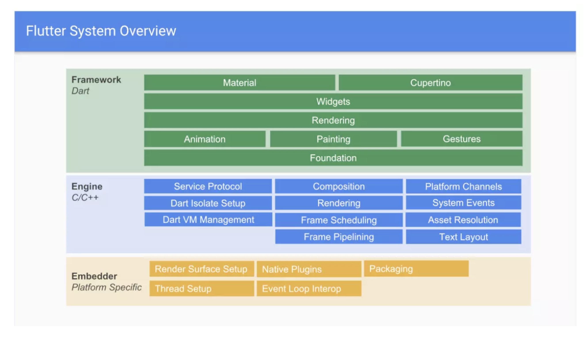
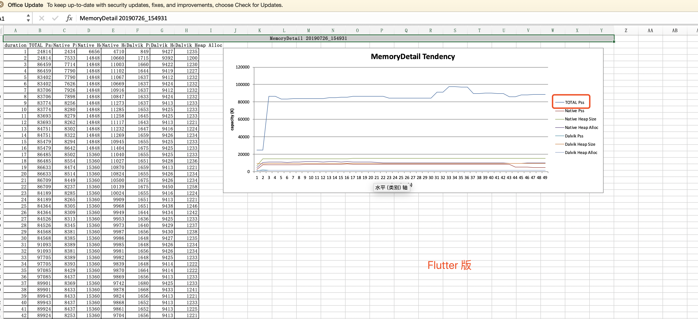
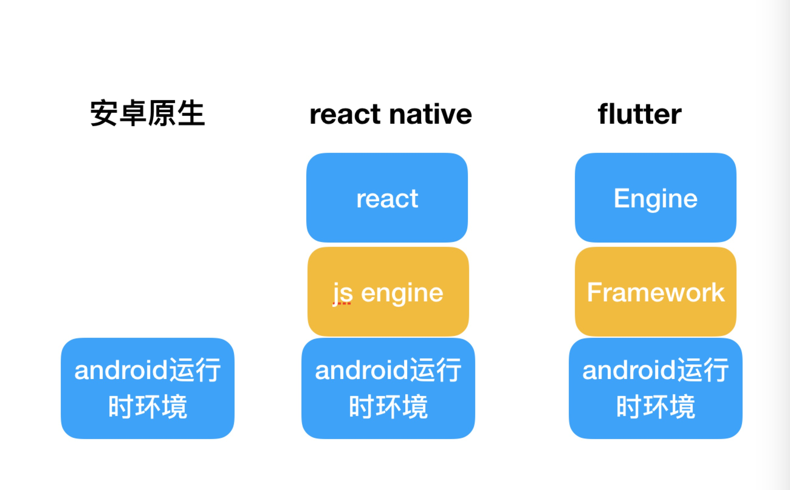

### 三者简单原理的一个分析篇一
#### react native
- react native采用jsCore做vm，通过jsbridge来和原生对接进行通信，不管是UI还是api都是类似基于配置文件来进行js和原生的转换。
- 在web中，通过React.Dom,可以将虚拟DOM转换为真实DOM，给到浏览器渲染。在React Native中，JSX 源码通过 React Native 框架编译后，通过对应平台的 Bridge 实现了与原生框架的通信。

React Native一个架构模型（图片来自网络）

#### flutter
- flutter实现整个Framework，Engine，使得脱离原生的UI和绘制等限制，自己基于skia进行绘制；字体排版等；
- flutter通过Platform Channels实现与原生的一个通信，获取平台系统的一些api,如电量等。
- 思考：**安卓系统内置了skia，所以flutter在打包时，可以不把skia打进去。减少APK包的一个大小**；

flutter一个架构模型（图片来自网络）

### 三者内存的一个对比
    从这种做的一个rn、原生、flutter的demo比对结果分析；对于内存的一个消耗**flutter(80Mb) > react native(50Mb) > 原生(25Mb)；**

内存分析图分析图如下(flutter)

内存分析图分析图如下(React Native)

内存分析图分析图如下(原生安卓)

### 分析三者架构分析内存占比的一个原因
- React Native底层采用react，需要js引擎来解析，最后还有一个ios/安卓运行的一个环境的支持实现；
- flutter单独实现Feamwork,还有Engine,最后还是要依赖ios/安卓运行的一个环境；

总体分析如下图：
