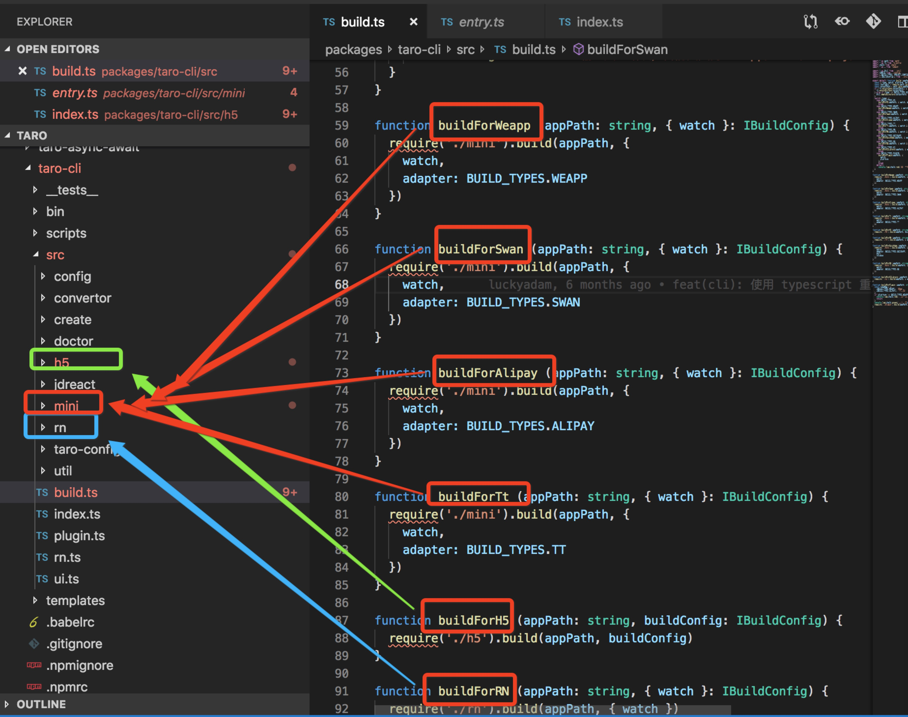

## Taro项目管理
Taro采用一系列的NPM包组成，拆分成一个个npm包来单独管理如：

- taro-taro: taro的一些多端解决方案基础框架基础模块；
- taro-cli: taro工程初始化，更新，构建脚本
- taro-weapp:用来把 taro 编写的代码编译成微信小程序代码
- taro-qq:用来把 taro 编写的代码编译成QQ小程序代码；
- taro-rn:用来把 taro 编写的代码编译成rn小程序代码；
- taro-h5:用来把 taro 编写的代码编译成h5小程序代码；
- ...

采用管理工具 Lerna来进行包管理；好处是

- 1、可以在主项目中，管理多个子项目；
- 2、可以解决包之间相互依赖，发布时需要手动维护成本；

## Taro一套代码运行不同端机制
根据type编译成不同类型的文件；第一步：先转换为各端的语言，第二步：在抹平各端的一个差异(如：api,生命周期，组件等)

-  第一步：将一门语言转换为另外一门语言，Taro选择babel。语法分析，转换为AST，对AST进行遍历和转换。在编译成对应的语法； 图如下：根据type调用不同的脚本类型；

- 第二步： 将其差异化选择抹平（因为不同的平台都有自己的特性，每一个平台都不尽相同，这些差异主要体现在不同的组件标准与不同的 API 标准以及不同的运行机制上。）不同类型的编译文件中，有对对应平台api进行再封装（native-api.js）文件中有描述。

 
### 选择微信小程序为标准机制

Taro多端适配，可以实现对微信小程序，支付宝小程序，qq小程序，h5,RN的一个适配，在选择规范标准中，选取了微信小程序的一个标准来做；原因有两点

- 1、可以少适配一端；
- 2、微信小程序文档规范全面，并且支付宝,qq小程序与之相差不多，减少后续适配的一个工作量；

