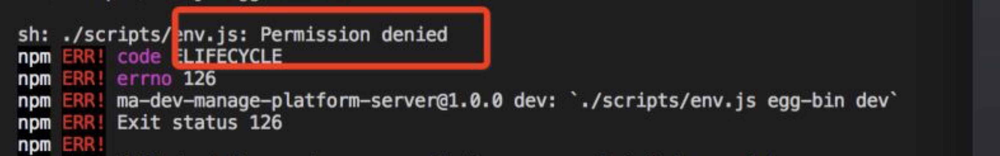

## egg bin permission denied
### how(怎么导致的)
在跑egg bin命名时，去调“./scripts/env.js”文件时,出现permission denied

### why（为什么会这样）
原因是在调用“./scripts/env.js”，系统权限遭到了拒绝，需要重新修改权限相关。
### what（怎么去解决）
sudo chmod +x ./scripts/env.js
### summary(总结)
#### chmod 
- "+" 表示增加权限
- "-" 表示取消权限
- "=" 表示唯一设定权限
#### 权限
- 读 r
- 写 w
- 执行 x