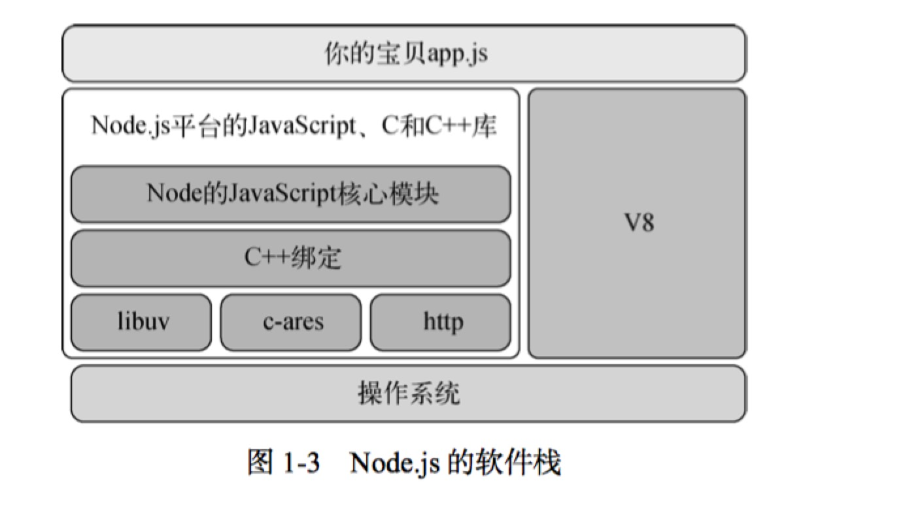

## node相关的一些全局变量
- __filename
- __dirname
- process
## node相关内置模块（可以和操作系统打交道获取）
- 相关内置模块：node是基于v8引擎运行的js代码，v8引擎会和操作系统打交道，获取相关内置模块信息；
- node是非阻塞线程的io;异步回调处理机制
## promise相关
- 异步第一时间内就拿到执行结果.then里面相关的回调
- promise中的错误是不会被抛到全局的，如果被catch捕获调以后；如果没有被catch捕获调，就会抛到全局；
- await/async 是promise的一个语法糖，是一个return的promise；
- await 中使用try catch可以捕获到相关的一个错误，在另外的一个事件循环机制中；await后面也可以跟着一个promise

## 第一章
- node用的是javascript语言，本身就是单线程的，优点是避免了死锁，竞争这些缺点；内部实现是非阻塞IO，事件轮询；
### 非阻塞IO；
    它的意思是说，你的程序可以在做其他事情时 发起一个请求来获取网络资源，然后当网络操作完成时，将会运行一个回调函数来处理这个操作 的结果。
### 事件轮询；
    浏览器实现异步的操作轮询机制类似；
### node底部架构图

## node 自带工具
### npm包管理
### node核心模块
- node内置了一些核心模块，赋予了node服务端的能力，比如：网络（http库）;文件系统（文件的io操作等);
### 三种主流node应用场景
- web应用程序
- 后台程序和命令行工具
- 桌面应用；

## 第二章：Node编程基础
### 用模块组织代码
- node使用CommonJS的规范来进行模块管理，require/module.exports来进行模板的依赖和导出；
- 在查找模板时，会先在核心模块中查找 -> 当前目录中查找 -> node_module中；模板会引用index.js中内容；除非在pageage中重写了main属性的指向；
- node能把模块对象缓存去了，如果多次引用，就会缓存在内存中;所以多次引用访问到的是同一个实例对象；
- 学会用创建中间函数，减少回调函数嵌套的问题；尽早返回错误的分支处理，减少嵌套层数。如：domain重构后的实现，整个实现就清晰了很多。
- 串型异步事件处理流，一个队列（数组）维护函数回调相关；
- 并行异步事件处理流，也有数组维护需要执行的事件，但是无关乎顺序，并列执行，处理器计数执行完的一个结果和接下来的一个执行后续情况。
 

